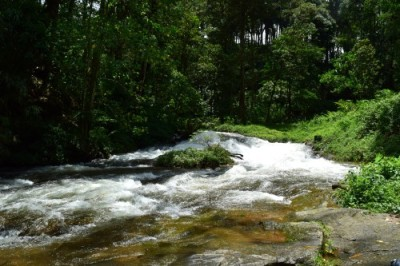

### Setup

1. Clone the repo
```
git clone https://github.com/root4me/staysolitude.git
```    
2. Navigate to the folder staysolitude. You will see this folder once the repo is cloned
```
cd staysolitude
```
3.  Site is running off a git hub page branch of the repo. So, point that branch to 'dist' folder under 'staysolitude'
```
git clone -b gh-pages https://github.com/root4me/staysolitude.git dist
```

  Folder structure will look like the following at this point
```
├── staysolitude
│   ├── app
│   ├── dist
```

4. Assuming you have node.js installed, fetch dependencies (If not install node js first)
```
npm install
```

5. Assuming you have bower installed, fetch ui dependencies (If not, install bower first `npm install -g bower`)
```
bower install
```
6. Assuming you have grunt installed, build and make changes to code (If not, install grunt first `npm install -g grunt-cli`)

7. To build and make changes to code
```
grunt dev
```
  This does not update deployable version of the site. You need to run `grunt build` followed by a checking for the changes to be reflected in the site

### Add new images to gallery
1. Copy the source images to \app\img\src (this is really a backup of the original image. Site doesn't use images from \src)  

2. Resize the original image to medium and small versions of the image. Name them  _medium.jpg and _small.jpg respectively and store under \app\img folder  

  _small images must be of width 500px  

  _meduim images must be of width 1800px  

  You can use any image editing software to resize the image. In ubuntu; I use shotwell

3. Generate html by running gallerygen script
  Navigate to staysolitude folder and run script
```
node gallerygen
```
This is a hacked together script and has much scope of improvement . So far it has only been run in ubuntu.  
I haven't tried on windows. you might have to change the '/' to '\\' in sort function if using this in windows. File access is typically the first thing that differ in windows. Or you could choose to comment out the sort function.

  Output of this script will look something like the following  

  ```
  .
  .
  <li><a href="img/waterfall_medium.jpg"></a></li>
  <li><a href="img/akulam_1_medium.jpg"></a></li>
  <li><a href="img/Kallar_medium.jpg"></a></li>
  .
  .
  --------------------------------------------
  done ..
  Copy and paste the above html into   <ul class="clearing-thumbs" data-clearing> inside gallery.html
  ```

4. Paste output of the script into gallery html
  Open \app\gallery.html
  Copy output of the script and paste it inside the following in gallery.html
  ```
  <ul class="clearing-thumbs small-block-grid-4" data-clearing>
  .
  .
  </ul>
  ```

  You can review the changes by viewing /app/gallery.html in the browser

5. Build deployable version of site
```
grunt build
```

6. Check in the code changes or Image changes (check in master)
  Navigate to \staysolitude  
  ```
  git status
  git add [all new files except for files under \dist , \bower_components , \node_modules]
  eg: git add app/img/src/*

  git commit -am "adding readme and minor modifications to gallerygen to include sorting"
  ```
7. Check in the deployable (check in \dist to gh-pages branch)
